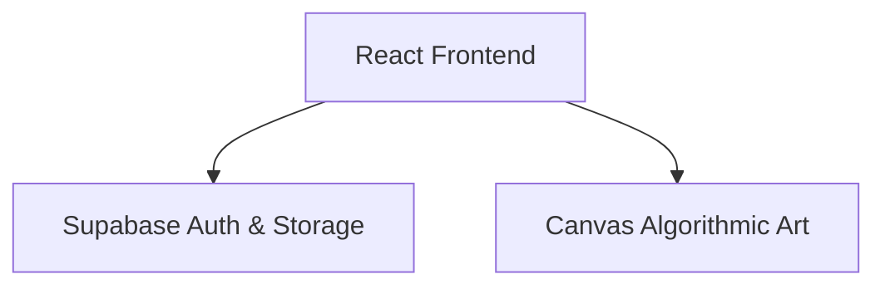

## 1. Architecture Design

## 2. Technology Description
- Frontend: React@18 + tailwindcss@3 + vite
- Initialization Tool: vite-init
- Backend: Supabase (Auth & Database)
- Database: Supabase (PostgreSQL)

## 3. Route Definitions
| Route | Purpose |
|-------|---------|
| / | 个人主页 (需要登录) |
| /login | 登录页面 |
| /register | 注册页面 |

## 4. API Definitions
无独立后端，使用 Supabase SDK 直接在前端调用

## 5. Data Model
使用 Supabase Auth 内置用户表，无需额外创建数据表。
