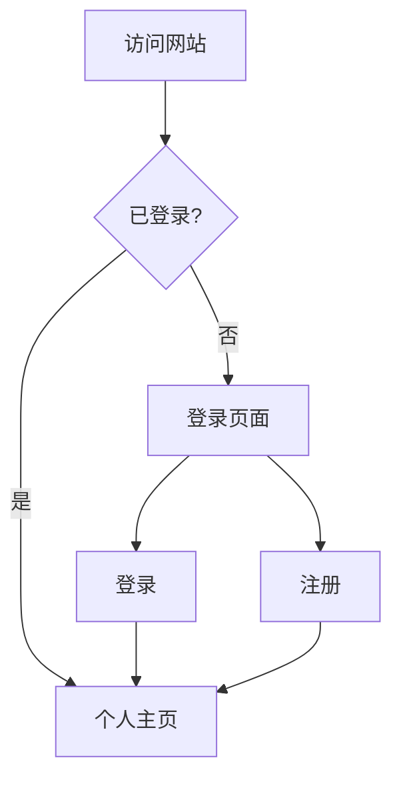

## 1. Product Overview
个人展示网站，包含用户认证系统、个人主页和算法艺术展示
- 解决用户在线展示个人作品和信息的需求
- 提供现代、美观的用户体验

## 2. Core Features

### 2.1 User Roles
| Role | Registration Method | Core Permissions |
|------|---------------------|------------------|
| Normal User | Email registration | 浏览主页、登录/注册、访问个人页面 |

### 2.2 Feature Module
1. **Login page**: 邮箱登录、表单验证、跳转至主页
2. **Register page**: 邮箱注册、密码确认、用户信息收集
3. **Home page**: 用户个人信息展示、导航菜单、算法艺术背景

### 2.3 Page Details
| Page Name | Module Name | Feature description |
|-----------|-------------|---------------------|
| Login page | Login form | 邮箱和密码输入、表单验证、登录按钮 |
| Register page | Register form | 姓名、邮箱、密码输入、密码确认、注册按钮 |
| Home page | Hero section | 用户头像、个人简介、导航菜单 |

## 3. Core Process
用户访问网站 → 若未登录则跳转至登录页 → 选择登录或注册 → 完成认证后跳转至个人主页 → 在主页浏览和交互

## 4. User Interface Design
### 4.1 Design Style
- 主色调：深蓝色 (#1e3a8a)，辅助色：青绿色 (#06b6d4)
- 按钮风格：圆角矩形，带微阴影
- 字体：Playfair Display 作为标题，Lato 作为正文字体
- 布局风格：卡片式布局，居中对齐
- 图标：使用线性图标，简洁现代

### 4.2 Page Design Overview
| Page Name | Module Name | UI Elements |
|-----------|-------------|-------------|
| Login page | Login form | 渐变背景、玻璃态卡片、流畅的表单动画 |
| Register page | Register form | 与登录页一致的设计语言 |
| Home page | Hero section | 算法艺术动态背景、用户信息卡片 |

### 4.3 Responsiveness
桌面优先设计，适配平板和移动设备

### 4.4 Algorithmic Art Guidance
- 使用 Canvas 实现动态粒子背景
- 粒子随鼠标移动产生引力效应
- 颜色渐变与主色调协调
